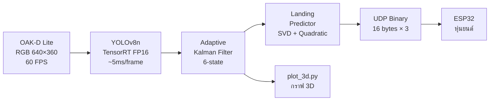
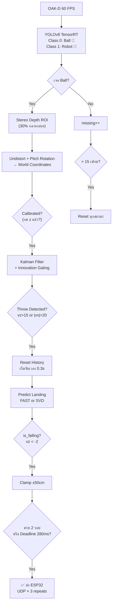
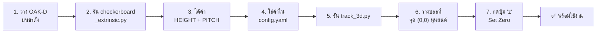

# MCE14 Vision — Technical Report
### ระบบตรวจจับลูกบอลและคำนวณจุดตก 3 มิติ สำหรับหุ่นยนต์รับบอล
**Version:** 2.1 — 15 พฤษภาคม 2569  
**ผู้เขียน:** ทีม MCE14 Vision  
**เอกสารนี้จัดทำเพื่อ:** ทีมพัฒนาหุ่นยนต์ (ESP32 Firmware)

---

## สารบัญ

1. [ภาพรวมระบบ](#1-ภาพรวมระบบ)
2. [สถาปัตยกรรม Hardware](#2-สถาปัตยกรรม-hardware)
3. [โครงสร้างซอฟต์แวร์](#3-โครงสร้างซอฟต์แวร์)
4. [Pipeline การประมวลผล](#4-pipeline-การประมวลผล)
5. [ระบบพิกัด (Coordinate System)](#5-ระบบพิกัด)
6. [Kalman Filter — รายละเอียดเชิงลึก](#6-kalman-filter)
7. [อัลกอริทึมคำนวณจุดตก](#7-อัลกอริทึมคำนวณจุดตก)
8. [โปรโตคอลการสื่อสาร UDP](#8-โปรโตคอล-udp)
9. [ระบบ Calibration](#9-ระบบ-calibration)
10. [ระบบ Safety & Failsafe](#10-ระบบ-safety)
11. [ข้อจำกัดและแนวทางพัฒนาต่อ](#11-ข้อจำกัด)

---

## 1. ภาพรวมระบบ

ระบบ MCE14 Vision ทำหน้าที่ตรวจจับลูกบอลสีแดงด้วยกล้อง OAK-D Lite คำนวณตำแหน่ง 3 มิติแบบ Real-time และพยากรณ์จุดตกบนพื้นผ่าน Kalman Filter + Curve Fitting จากนั้นส่งพิกัดจุดตกไปยัง ESP32 ผ่าน UDP ภายใน **< 300 มิลลิวินาที** หลังตรวจจับการโยน



### ตัวเลขสำคัญ (Key Metrics)

| Metric | ค่า |
|--------|-----|
| Camera FPS | 60 FPS (OAK-D Lite ISP 640×360) |
| YOLO Inference | ~3-8 ms (TensorRT FP16, CUDA) |
| KF + Prediction | < 1 ms |
| **Throw → Send Latency** | **~50-100 ms (ปกติ) / สูงสุด 280 ms (Deadline)** |
| UDP Packet Size | 16 bytes × 3 repeats |
| Depth Range (Effective) | 40 cm — 400 cm |
| Workspace | ±50 cm (XY) |

---

## 2. สถาปัตยกรรม Hardware

### 2.1 OAK-D Lite

| Component | Spec |
|-----------|------|
| RGB Sensor | IMX214, 1080p → ISP Scale 1/3 = **640×360** |
| Stereo Pair | OV7251 × 2 (Mono 480p) |
| Stereo Depth | **Sub-pixel** enabled, Median 7×7 |
| Spatial + Temporal Filter | Enabled (ลด noise depth) |
| Depth Align | Aligned to RGB (CAM_A) |
| Interface | USB3 via DepthAI SDK |

### 2.2 ระบบ Network

```
┌──────────┐     WiFi Hotspot     ┌──────────┐
│ Computer │ ─── 192.168.137.x ── │  ESP32   │
│ (Vision) │     UDP Port 12345   │ (Robot)  │
└──────────┘                      └──────────┘
      │
      │ Localhost UDP Port 5005
      ▼
 plot_3d.py (กราฟ 3D)
```

> [!IMPORTANT]
> คอมพิวเตอร์ต้องเปิด **Mobile Hotspot** (Windows) หรือ **AP Mode** เพื่อให้ ESP32 เชื่อมต่อ WiFi ได้ ไม่ใช้ Router ภายนอก

---

## 3. โครงสร้างซอฟต์แวร์

### 3.1 ไฟล์ทั้งหมด (16 ไฟล์)

| ไฟล์ | หน้าที่ | หมายเหตุ |
|------|---------|---------|
| **track_3d.py** | ⭐ ไฟล์หลัก — OAK-D + YOLO + KF + UDP | 698 บรรทัด |
| **ball_tracker_kf.py** | 🆕 โมดูลกลาง KF + Landing Predictor | แชร์กับ dual camera |
| **track_dual_3d.py** | ทางเลือก — Dual Camera Triangulation | OAK-D + Webcam |
| **udp_sender.py** | Class ส่ง UDP Binary ไป ESP32 | 16 bytes + redundancy |
| **plot_3d.py** | กราฟ 3D Real-time (Matplotlib) | รับ UDP จาก track_3d |
| **config.yaml** | 🆕 ค่าคงที่ทั้งหมด | ย้ายสถานที่ง่าย |
| **local_udp_receiver.py** | จำลอง ESP32 ฝั่งรับ (ทดสอบบน PC) | — |
| **test_robot.py** | ชุดทดสอบหุ่นยนต์ 7 บท | Ping/UDP/Move/Stall |
| **test_manual.py** | สั่งหุ่นยนต์แบบ Manual (กรอก X, Y) | — |
| **test_dual_camera.py** | ทดสอบ Latency กล้อง 2 ตัว | — |
| **pitch_calibrate.py** | Calibrate มุมก้มเงยกล้อง | ใช้ลูกบอล |
| **checkerboard_extrinsic.py** | Calibrate ความสูง+มุมกล้อง | ใช้ SolvePnP |
| **stereo_calibrate.py** | Stereo Calibration กล้อง 2 ตัว | OAK-D + Webcam |
| **train.py** | Train YOLOv8n | Custom dataset |
| **export_engine.py** | แปลง .pt → TensorRT .engine | FP16 |
| **extract_frames.py** | แตกภาพจากวิดีโอ → Dataset | — |

### 3.2 Dependencies

```
opencv-python, depthai, ultralytics, torch, numpy, matplotlib, pyyaml
```

---

## 4. Pipeline การประมวลผล



### 4.1 Timing Budget (ที่ 60 FPS)

```
Frame interval:     16.7 ms
YOLO inference:      5.0 ms
Depth + Transform:   1.5 ms
KF + Prediction:     0.5 ms
UDP + Display:       2.0 ms
────────────────────────────
Remaining budget:    7.7 ms ✓
```

---

## 5. ระบบพิกัด

### 5.1 การแปลงจากกล้องเป็นหุ่นยนต์

```
กล้อง (Camera Frame)           →    หุ่นยนต์ (Robot Frame)
─────────────────────────────────────────────────────────
X_cam (ซ้าย-ขวา pixel)         →    Y_cm (ซ้าย-ขวา)
Y_cam (บน-ล่าง pixel)          →    Z_cm (ความสูง)
Z_cam (Stereo Depth, mm)       →    X_cm (ความลึก)
```

### 5.2 สูตรการแปลง (ใน track_3d.py)

```python
# 1. Undistort จุดกึ่งกลาง Bounding Box
u_cx, u_cy = cv2.undistortPoints(center, camera_matrix, dist_coeffs)

# 2. Pinhole Model → Camera 3D (mm)
X_mm = (u_cx - cx) * Z_mm / fx
Y_mm = (u_cy - cy) * Z_mm / fy

# 3. Pitch Rotation → World Frame (cm)
theta = radians(CAMERA_PITCH_DEG)
Y_world = (Y_c * cos(theta) + Z_c * sin(theta))
Z_world = (-Y_c * sin(theta) + Z_c * cos(theta))

# 4. สลับแกน → Robot Frame (cm)
X_cm = ORIGIN_Y_DISTANCE_CM - Z_world     # ความลึก (กล้อง→หุ่น)
Y_cm = X_c - ORIGIN_X_OFFSET_CM           # ซ้าย-ขวา
Z_cm = CAMERA_HEIGHT_CM - Y_world          # ความสูงจากพื้น
```

### 5.3 ทิศทางแกนของหุ่นยนต์ (Robot Frame)

```
         กล้อง (OAK-D)
            │
    X+ ◄────┼────► X- (ความลึก: กล้อง→หุ่น)
            │
     Y- ◄───┼───► Y+ (ซ้าย-ขวา)
            │
         Z+ ▲ (ความสูง)
            │
           พื้น (Z = 0)
```

> [!NOTE]
> **จุด Origin (0, 0, 0)** ถูกตั้งค่าตอนกดปุ่ม **'z'** ที่ตำแหน่งลูกบอลตอน Calibrate — ค่า `ORIGIN_Y_DISTANCE_CM` และ `ORIGIN_X_OFFSET_CM` จะถูกเขียนทับ

---

## 6. Kalman Filter — รายละเอียดเชิงลึก

### 6.1 State Vector (6×1)

$$\mathbf{x} = \begin{bmatrix} x \\ y \\ z \\ v_x \\ v_y \\ v_z \end{bmatrix}$$

### 6.2 State Transition (F) + Gravity (B)

$$\mathbf{x}_{k+1} = F \cdot \mathbf{x}_k + B$$

```python
F = [[1, 0, 0, dt, 0,  0 ],
     [0, 1, 0, 0,  dt, 0 ],
     [0, 0, 1, 0,  0,  dt],
     [0, 0, 0, 1,  0,  0 ],
     [0, 0, 0, 0,  1,  0 ],
     [0, 0, 0, 0,  0,  1 ]]

B = [0, 0, -0.5*g*dt², 0, 0, -g*dt]    # g = 981 cm/s²
```

### 6.3 Noise Matrices

**Process Noise Q:**
```python
Q = diag([0.1, 0.1, 0.1, 150, 150, 150])
#          position          velocity (สูงเพื่อให้ track การเปลี่ยนทิศเร็ว)
```

**Measurement Noise R (Adaptive):**
```python
distance_m = abs(ORIGIN_Y_DISTANCE_CM - measurement[0]) / 100.0
R = diag([
    10.0 + distance_m² × 15.0,    # X (depth) — noise เพิ่มตามระยะ²
    5.0 + distance_m^1.5 × 3.0,   # Y (lateral)
    5.0 + distance_m^1.5 × 5.0    # Z (height)
])
```

### 6.4 Innovation Gating (Outlier Rejection)

ก่อนอัปเดต KF จะตรวจสอบ **Mahalanobis Distance** ของ Innovation Vector:

$$d^2 = \mathbf{y}^T S^{-1} \mathbf{y}$$

ถ้า $d^2 > 16.27$ (chi-squared, 3 DOF, p = 0.001) → **ปฏิเสธ measurement** ไม่อัปเดต KF

**ผลลัพธ์:** ป้องกัน KF กระโดดตาม YOLO ที่ตรวจจับผิดวัตถุ (เช่น มือสีแดง)

---

## 7. อัลกอริทึมคำนวณจุดตก

### 7.1 โหมด FAST (predict_landing_fast)

**ใช้เมื่อ:** History < 5 จุด (ช่วง 0-170ms แรกหลังโยน)

```
Input:  KF State [x, y, z, vx, vy, vz]
Output: (landing_x, landing_y)

สมการ: Z(t) = z + vz·t − ½g·t² = 0
แก้สมการกำลังสอง → t_land
landing_x = (x + vx·t_land) × 0.92    ← Drag Correction
landing_y = (y + vy·t_land) × 0.92
```

### 7.2 โหมด SVD (predict_landing)

**ใช้เมื่อ:** History ≥ 5 จุด (แม่นยำกว่า)

```
Step 1: SVD Denoising
   - Mean-center XY coordinates
   - SVD → Principal Component (ทิศทางบินหลัก)
   - Project ลง PC → ลบ lateral noise

Step 2: Linear Curve Fit (cleaned XY)
   X(t) = vx·t + x0
   Y(t) = vy·t + y0

Step 3: Parabolic Z (gravity fixed)
   Z_adj = Z + ½g·t² → Linear fit → vz, z0
   Solve: -½g·t² + vz·t + z0 = 0 → t_land

Step 4: Landing Point
   landing_x = (x0 + vx·t_land) × 0.92
   landing_y = (y0 + vy·t_land) × 0.92
```

### 7.3 Air Drag Correction

ค่า `DRAG_CORRECTION = 0.92` ชดเชยแรงต้านอากาศสำหรับลูกบอลเส้นผ่าศูนย์กลาง ~6cm (Cd ≈ 0.47 ที่ Re ~10⁴) ซึ่งทำให้จุดตกจริงอยู่ใกล้กว่าที่โมเดล Vacuum Projectile คำนวณ ~8%

---

## 8. โปรโตคอล UDP

### 8.1 Packet Format (Computer → ESP32)

```
┌────────────────────────────────────────────────────┐
│ Byte 0-3      │ Byte 4-7  │ Byte 8-11 │ Byte 12-15│
│ seq (uint32)  │ x (float) │ y (float) │ z (float) │
│ Little Endian │ cm        │ cm        │ cm        │
└────────────────────────────────────────────────────┘
Total: 16 bytes | Format: struct.pack('<Ifff', seq, x, y, z)
```

### 8.2 Redundant Send

ทุก packet ถูกส่งซ้ำ **3 ครั้ง** ด้วย Sequence Number เดียวกัน:

```python
for _ in range(3):          # ส่งซ้ำ 3 รอบ
    for ip in self.ips:     # ส่งทุก ESP32
        sock.sendto(data, (ip, port))
```

> [!IMPORTANT]
> **ESP32 ต้อง deduplicate** ด้วย Sequence Number — ถ้า seq เท่าเดิม ให้ข้ามไม่ประมวลผลซ้ำ
>
> ```c
> // ESP32 Firmware (ตัวอย่าง)
> static uint32_t last_seq = 0;
> if (packet.seq == last_seq) return;  // duplicate
> last_seq = packet.seq;
> move_to(packet.x, packet.y);
> ```

### 8.3 Packet สำหรับ plot_3d.py (Text-based)

```
Format: "x,y,z,landing_x,landing_y,vx,vy,vz"
   หรือ: "x,y,z,None,None,vx,vy,vz"
Port:   5005 (localhost)
```

### 8.4 เงื่อนไขการส่ง

ระบบจะส่งพิกัดจุดตกไป ESP32 **เพียงครั้งเดียว** ต่อการโยน 1 ครั้ง เมื่อเงื่อนไขใดเงื่อนไขหนึ่งเป็นจริง:

| เงื่อนไข | รายละเอียด |
|----------|-----------|
| **ปกติ** | KF คำนวณจุดตกได้สำเร็จ ≥ 2 รอบ **และ** ลูกบอลกำลังตก (vz < -2) |
| **Deadline** | เวลาผ่านไป ≥ 280ms หลัง Throw Detection **และ** มีจุดตกที่คำนวณได้ |

---

## 9. ระบบ Calibration

### 9.1 ขั้นตอนการ Calibrate (ก่อนใช้งาน)



### 9.2 ค่า Configuration หลัก

| ค่า | Default | วิธีหา | ที่เก็บ |
|-----|---------|-------|--------|
| `CAMERA_HEIGHT_CM` | 121.4 | checkerboard_extrinsic.py | config.yaml |
| `CAMERA_PITCH_DEG` | 0.0 | pitch_calibrate.py | config.yaml |
| `ORIGIN_Y_DISTANCE_CM` | 323.3 | กดปุ่ม 'z' ตอน Runtime | Runtime (ไม่บันทึก) |
| `ORIGIN_X_OFFSET_CM` | 0.0 | กดปุ่ม 'z' ตอน Runtime | Runtime (ไม่บันทึก) |

### 9.3 ปุ่มควบคุมขณะรัน

| ปุ่ม | ฟังก์ชัน |
|------|---------|
| **z** | Set Zero — ตั้งจุด Origin (0,0) ที่ตำแหน่งลูกบอลปัจจุบัน |
| **r** | เริ่ม/หยุดบันทึกวิดีโอ (.mp4) |
| **q** | ออกจากโปรแกรม |

---

## 10. ระบบ Safety & Failsafe

### 10.1 Throw Detection

| เงื่อนไข | ค่า |
|----------|-----|
| Trigger | `vz > 15` หรือ `|vx| > 20` cm/s |
| Cooldown | 1.5 วินาที (ป้องกันตรวจจับซ้ำ) |
| Action | Reset history, boost P, เริ่มจับเวลา 0.3s |

### 10.2 Missing Frames Recovery

| สถานการณ์ | Action |
|----------|--------|
| Ball หายไป > 15 เฟรม (~250ms) | Reset: process_count, landing, throw state |
| KF Z < 5 cm + is_thrown | บอลตกถึงพื้นแล้ว → reset throw state |

### 10.3 Clamp (พื้นที่ปลอดภัย)

จุดตกที่คำนวณได้จะถูก clamp ไว้ที่ **±50 cm** ทั้ง X และ Y:
```python
clamped_x = max(-50.0, min(50.0, landing_x))
clamped_y = max(-50.0, min(50.0, landing_y))
```
ถ้าค่าจริงอยู่นอกขอบเขต → แสดง "OUT OF BOUNDS (CLAMPED)" บนหน้าจอ แต่ยังส่งค่า clamped ให้หุ่นวิ่งไปขอบสุด

---

## 11. ข้อจำกัดและแนวทางพัฒนาต่อ

### 11.1 ข้อจำกัดปัจจุบัน

| ข้อจำกัด | ผลกระทบ | ระดับ |
|---------|---------|-------|
| Single-threaded Python | YOLO บล็อก frame capture ทำให้อาจ drop frame | Medium |
| ไม่มี ACK จาก ESP32 | ไม่ทราบว่า ESP32 ได้รับ packet จริงหรือไม่ | Medium |
| Magnus Effect ไม่ได้คำนวณ | ลูกบอลที่มี spin จะโค้งมากกว่าที่คาด ~2-3% | Low |
| ค่า DRAG_CORRECTION คงที่ | ลูกบอลต่างขนาด/น้ำหนัก อาจต้องปรับค่า | Low |

### 11.2 แนวทางพัฒนาต่อ

| # | รายการ | Effort |
|---|--------|--------|
| 1 | **Threading** แยก Capture / Inference / Display | 2 ชม. |
| 2 | **ESP32 ACK** — ส่ง response กลับยืนยันรับ packet | 2 ชม. (ต้องแก้ firmware) |
| 3 | **Unit Tests** สำหรับ KF + Landing Predictor | 3 ชม. |
| 4 | **โหลด config.yaml** อัตโนมัติตอนเริ่มรัน | 1 ชม. |
| 5 | **Type Hints** ทั้งโปรเจค | 2 ชม. |

### 11.3 Log File

ทุกการโยนจะถูกบันทึกลงไฟล์ CSV:
```
ชื่อไฟล์: landing_log_YYYYMMDD_HHMMSS.csv
คอลัมน์: Timestamp, Clamped_X, Clamped_Y, Raw_X, Raw_Y, Vx, Vy, Vz, Elapsed_ms
```

---

> [!TIP]
> **สำหรับทีมหุ่นยนต์:** สิ่งที่ต้องทำฝั่ง ESP32 มีเพียง 3 อย่าง:
> 1. **เชื่อมต่อ WiFi** ไปที่ Hotspot ของคอมพิวเตอร์
> 2. **รับ UDP port 12345** → unpack `<Ifff` (16 bytes) → ได้ seq, x, y, z
> 3. **Deduplicate** ด้วย seq number → เอา x, y ไปสั่ง motor วิ่งไปตำแหน่งนั้น
